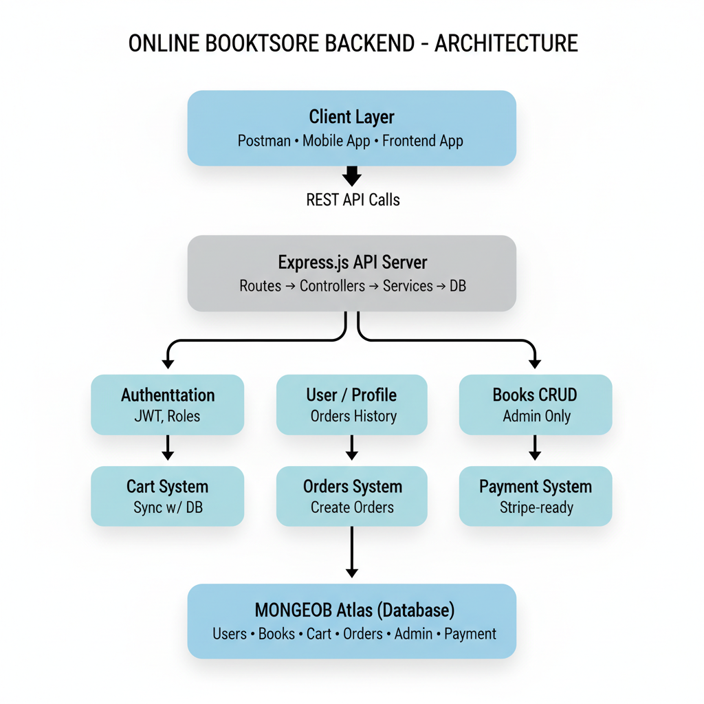

# 📚 Online Bookstore Backend (Node.js + Express + TypeScript + MongoDB)

A robust backend API for a full-featured **Online Bookstore**, built with modern best practices.  
It supports authentication, carts, orders, admin book management, and is ready for real payment integration.

---

## 📸 System Architecture

Below is the architecture diagram used in this project:

---

## 🚀 Features

### 🔐 Authentication
- Register, login, logout
- JWT with httpOnly cookies (secure)
- Access + Refresh tokens
- Password hashing (bcrypt)
- Admin role support

### 📘 Books
- List all books
- Single book view
- Search by title
- Admin CRUD (add/update/delete)
- Supports Cloudinary image upload (optional)

### 🛒 Cart
- Add item
- Update item quantity
- Remove item
- Clear entire cart
- Cart stored per user in DB
- Auto-sync on login
- Fully persistent

### 📦 Orders
- Create order from cart
- Validates stock
- Stores order history
- Prepares for Razorpay/Stripe integration

### 🛡 Security
- httpOnly cookies
- CORS configuration
- Role-based middleware
- Input validation
- Sanitized DB operations

---

## 🧱 Tech Stack

| Layer | Tools |
|-------|--------|
| Language | **TypeScript** |
| Runtime | Node.js |
| Framework | Express |
| Database | MongoDB (Mongoose ORM) |
| Auth | JWT + bcrypt |
| Media | Cloudinary (optional) |
| Dev Tools | Nodemon, ts-node-dev |

---

# Open to suggestions and improvements😊
